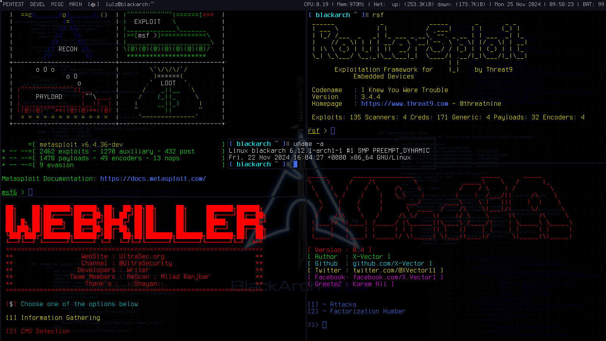

# <h3>cd ~/.dwm </h3>
# <h3>patch -p1 < dwm-autostart-20210120-cb3f58a.diff </h3>
# <h3>patch -p1 < dwm-bar-height-6.2.diff </h3>
# <h3>sudo mv ~/.dwm/bar /usr/local/bin/ && sudo chmod +x /usr/local/bin/bar </h3>
# <h3>sudo mv ~/.dwm/simple-tokyonight.rasi /usr/share/rofi/themes/ </h3>
#<h3>mv ~/.dwm/.Xresources /home/user/ && xrdb -merge ~/.Xresources</h3>

